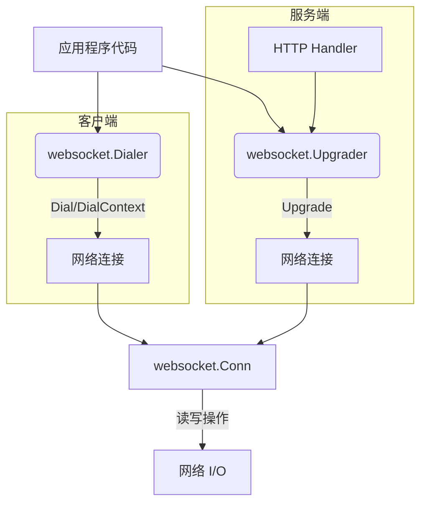
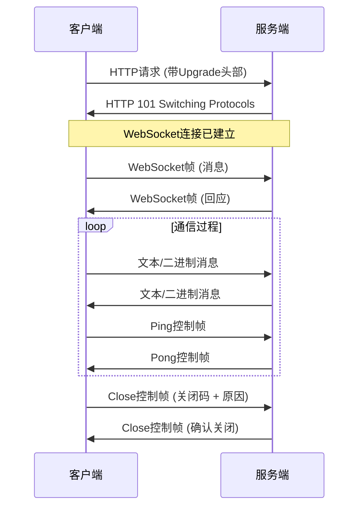
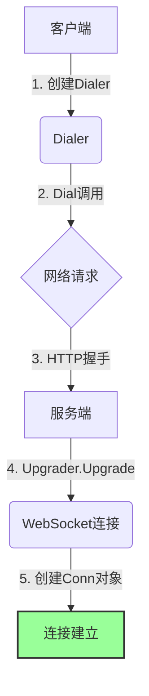
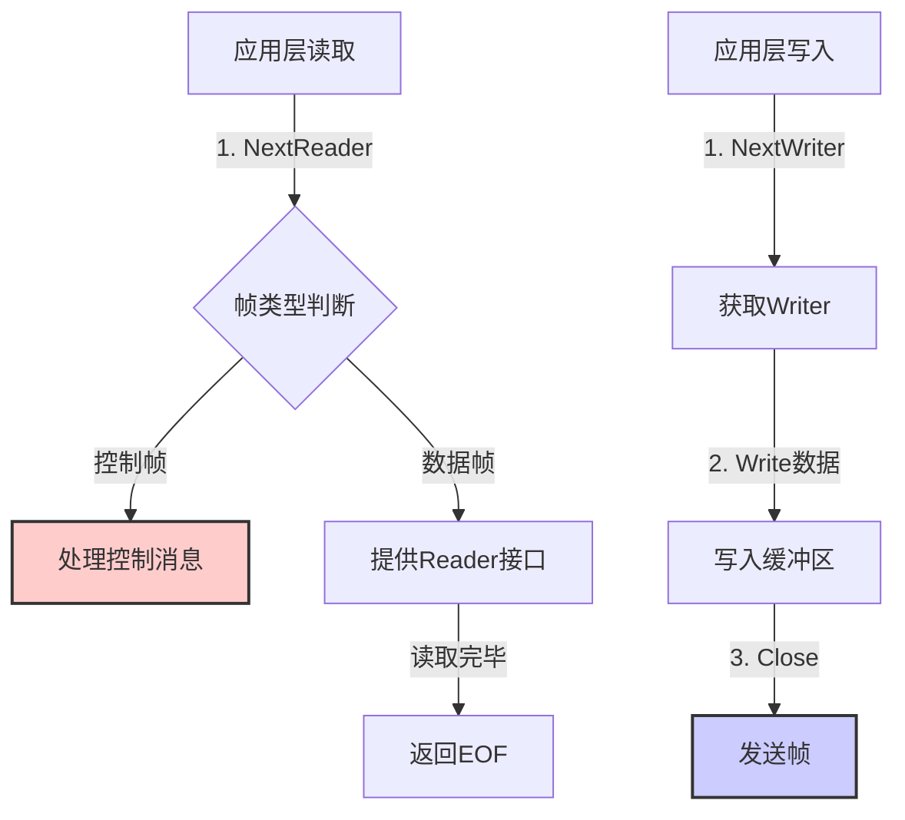
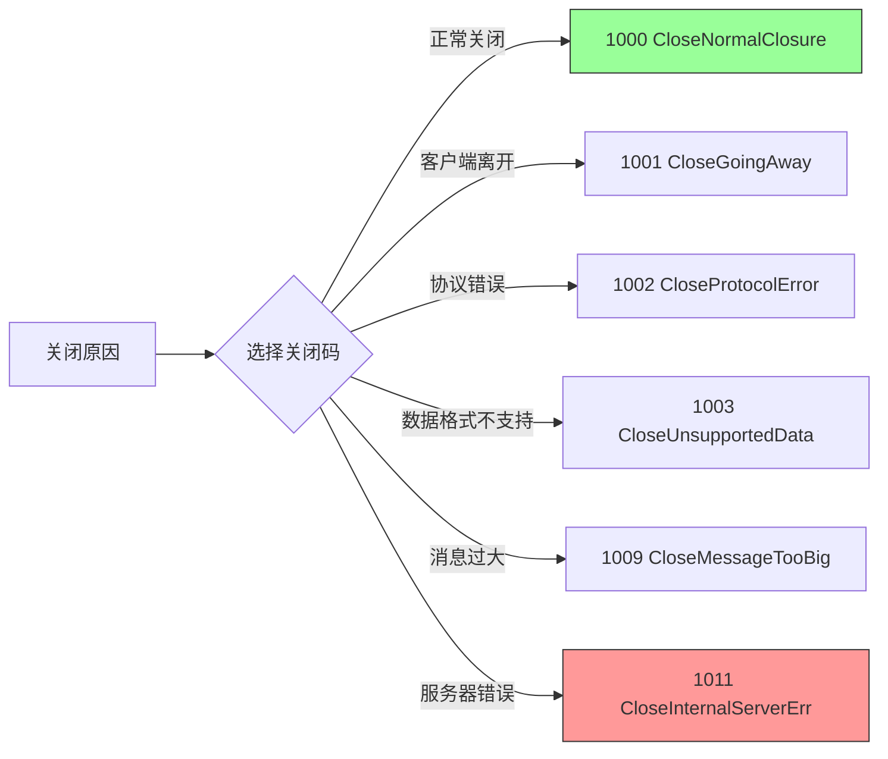

# Gorilla WebSocket 项目文档

## 1. 项目概述

Gorilla WebSocket 是一个实现 RFC 6455 定义的 WebSocket 协议的 Go 语言库。它提供了一套完整的客户端和服务端 API，用于建立和管理 WebSocket 连接，从而实现网页与服务器之间的全双工通信。

### 核心特性

- 完整实现 WebSocket 协议 (RFC 6455)
- 支持客户端和服务端
- 提供简单易用的 API
- 支持消息压缩 (RFC 7692)
- 内置 JSON 编码/解码支持
- 通过 Autobahn 测试套件验证协议合规性
- 性能优化的消息处理
- 灵活的并发控制

### 核心模块架构



### WebSocket协议工作流程



## 2. 安装与依赖

```bash
go get github.com/gorilla/websocket
```

### 依赖要求

- Go 1.20 或更高版本
- 标准库依赖: net, crypto/tls, io, encoding/json
- 外部依赖: golang.org/x/net v0.26.0

## 3. 核心组件

### 3.1 Conn

`Conn` 类型表示一个 WebSocket 连接，封装了底层网络连接，提供读写 WebSocket 消息的方法。

```go
type Conn struct {
    // 内部字段不直接访问
}

// 主要方法
func (c *Conn) ReadMessage() (messageType int, p []byte, err error)
func (c *Conn) WriteMessage(messageType int, data []byte) error
func (c *Conn) Close() error
```

#### 消息类型常量

```go
const (
    // TextMessage 文本类型消息，使用UTF-8编码
    TextMessage = 1
    
    // BinaryMessage 二进制类型消息
    BinaryMessage = 2
    
    // CloseMessage 关闭控制消息
    CloseMessage = 8
    
    // PingMessage ping控制消息
    PingMessage = 9
    
    // PongMessage pong控制消息
    PongMessage = 10
)
```

### 3.2 Upgrader

`Upgrader` 类型用于将 HTTP 连接升级为 WebSocket 连接，通常在服务端使用。

```go
type Upgrader struct {
    ReadBufferSize    int
    WriteBufferSize   int
    HandshakeTimeout  time.Duration
    CheckOrigin       func(r *http.Request) bool
    EnableCompression bool
    // 其他配置字段...
}

func (u *Upgrader) Upgrade(w http.ResponseWriter, r *http.Request, 
                          responseHeader http.Header) (*Conn, error)
```

### 3.3 Dialer

`Dialer` 类型用于客户端连接 WebSocket 服务器。

```go
type Dialer struct {
    NetDial            func(network, addr string) (net.Conn, error)
    NetDialContext     func(ctx context.Context, network, addr string) (net.Conn, error)
    NetDialTLSContext  func(ctx context.Context, network, addr string) (net.Conn, error)
    Proxy              func(*http.Request) (*url.URL, error)
    TLSClientConfig    *tls.Config
    HandshakeTimeout   time.Duration
    ReadBufferSize     int
    WriteBufferSize    int
    EnableCompression  bool
    // 其他配置字段...
}

func (d *Dialer) Dial(urlStr string, requestHeader http.Header) (*Conn, *http.Response, error)
func (d *Dialer) DialContext(ctx context.Context, urlStr string, requestHeader http.Header) (*Conn, *http.Response, error)
```

## 4. 函数调用关系

### 4.1 连接建立过程



### 4.2 消息处理流程



## 5. 使用指南

### 5.1 服务端实现

基本服务端实现示例:

```go
package main

import (
    "log"
    "net/http"
    "github.com/gorilla/websocket"
)

var upgrader = websocket.Upgrader{
    ReadBufferSize:  1024,
    WriteBufferSize: 1024,
}

func handleWebSocket(w http.ResponseWriter, r *http.Request) {
    // 将 HTTP 连接升级为 WebSocket
    conn, err := upgrader.Upgrade(w, r, nil)
    if err != nil {
        log.Printf("升级失败: %v", err)
        return
    }
    defer conn.Close()

    // 消息处理循环
    for {
        messageType, message, err := conn.ReadMessage()
        if err != nil {
            if websocket.IsUnexpectedCloseError(err, websocket.CloseGoingAway, 
                                                websocket.CloseNormalClosure) {
                log.Printf("错误: %v", err)
            }
            break
        }

        // 处理收到的消息
        log.Printf("收到: %s", message)

        // 将消息回送给客户端
        if err := conn.WriteMessage(messageType, message); err != nil {
            log.Printf("写入错误: %v", err)
            break
        }
    }
}

func main() {
    http.HandleFunc("/ws", handleWebSocket)
    log.Fatal(http.ListenAndServe(":8080", nil))
}
```

### 5.2 客户端实现

基本客户端实现示例:

```go
package main

import (
    "log"
    "os"
    "os/signal"
    "time"
    "github.com/gorilla/websocket"
)

func main() {
    // 连接服务器
    c, _, err := websocket.DefaultDialer.Dial("ws://localhost:8080/ws", nil)
    if err != nil {
        log.Fatal("连接失败:", err)
    }
    defer c.Close()

    // 捕获中断信号
    interrupt := make(chan os.Signal, 1)
    signal.Notify(interrupt, os.Interrupt)

    done := make(chan struct{})

    // 读取消息的 goroutine
    go func() {
        defer close(done)
        for {
            _, message, err := c.ReadMessage()
            if err != nil {
                log.Println("读取错误:", err)
                return
            }
            log.Printf("收到: %s", message)
        }
    }()

    // 发送消息
    ticker := time.NewTicker(time.Second)
    defer ticker.Stop()

    for {
        select {
        case <-done:
            return
        case t := <-ticker.C:
            err := c.WriteMessage(websocket.TextMessage, []byte(t.String()))
            if err != nil {
                log.Println("写入错误:", err)
                return
            }
        case <-interrupt:
            // 优雅关闭连接
            log.Println("interrupt")
            err := c.WriteMessage(
                websocket.CloseMessage,
                websocket.FormatCloseMessage(websocket.CloseNormalClosure, ""),
            )
            if err != nil {
                log.Println("关闭错误:", err)
                return
            }
            select {
            case <-done:
            case <-time.After(time.Second):
            }
            return
        }
    }
}
```

### 5.3 使用 JSON 消息

Gorilla WebSocket 提供 JSON 编码/解码支持:

```go
// 发送 JSON
type Message struct {
    Type string `json:"type"`
    Data string `json:"data"`
    Time int64  `json:"time"`
}

msg := Message{
    Type: "greeting",
    Data: "Hello WebSocket",
    Time: time.Now().Unix(),
}

if err := conn.WriteJSON(msg); err != nil {
    log.Println("写入 JSON 错误:", err)
    return
}

// 接收 JSON
var receivedMsg Message
if err := conn.ReadJSON(&receivedMsg); err != nil {
    log.Println("读取 JSON 错误:", err)
    return
}
```

## 6. 高级功能

### 6.1 消息压缩

WebSocket 协议支持 RFC 7692 定义的消息压缩。

```go
// 服务端启用压缩
var upgrader = websocket.Upgrader{
    EnableCompression: true,
}

// 客户端启用压缩
dialer := &websocket.Dialer{
    EnableCompression: true,
}

// 启用/禁用连接写压缩
conn.EnableWriteCompression(true)

// 设置压缩级别
conn.SetCompressionLevel(9) // 最高级别压缩
```

### 6.2 并发控制

WebSocket 连接支持一个并发读取和一个并发写入。应用程序负责确保并发安全:

```go
// 读循环 (一个 goroutine)
go func() {
    for {
        messageType, message, err := conn.ReadMessage()
        if err != nil {
            // 处理错误
            break
        }
        // 处理消息
    }
}()

// 写循环 (另一个 goroutine)
go func() {
    for msg := range messageChan {
        err := conn.WriteMessage(websocket.TextMessage, msg)
        if err != nil {
            // 处理错误
            break
        }
    }
}()

// Close 和 WriteControl 可以与其他方法并发调用
```

### 6.3 代理支持

Dialer 支持通过 HTTP 或 SOCKS 代理连接:

```go
dialer := &websocket.Dialer{
    Proxy: http.ProxyFromEnvironment,
}

// 或显式指定
dialer := &websocket.Dialer{
    Proxy: func(req *http.Request) (*url.URL, error) {
        return url.Parse("http://proxy-server:8080")
    },
}
```

## 7. 开发环境与调试

### 7.1 开发环境配置

```mermaid
graph TD
    A[安装Go 1.20+] -->B(获取WebSocket库)
    B -->|go get github.com/gorilla/websocket| C[导入库]
    C -->|import "github.com/gorilla/websocket"| D[创建应用]
    D --> E{运行测试}
    E -->|通过| F[部署应用]
    E -->|失败| G[修复问题]
    G --> E
```

### 7.2 调试提示

在调试WebSocket应用时的常用方法：

1. **日志调试**
   ```go
   // 设置详细日志
   log.SetFlags(log.Ldate | log.Ltime | log.Lmicroseconds | log.Lshortfile)
   
   // 记录连接事件
   log.Printf("新连接: %s", conn.RemoteAddr())
   ```

2. **检查工具**
   * 使用浏览器开发者工具的Network标签监控WebSocket连接
   * 使用 [wscat](https://github.com/websockets/wscat) 命令行工具测试连接

3. **超时问题排查**
   ```go
   // 延长握手超时时间
   var upgrader = websocket.Upgrader{
       HandshakeTimeout: 30 * time.Second,
   }
   ```

4. **内存监控**
   ```go
   // 限制最大消息大小
   conn.SetReadLimit(1024 * 1024) // 1MB
   ```

## 8. 最佳实践

### 8.1 错误处理

```go
if err != nil {
    if websocket.IsUnexpectedCloseError(err, 
        websocket.CloseGoingAway, websocket.CloseNormalClosure) {
        log.Printf("错误: %v", err)
    }
    return
}
```

### 8.2 连接保活

```go
// 服务端设置 Pong 处理器更新读截止日期
conn.SetReadDeadline(time.Now().Add(pongWait))
conn.SetPongHandler(func(string) error { 
    conn.SetReadDeadline(time.Now().Add(pongWait)) 
    return nil 
})

// 客户端定期发送 Ping
ticker := time.NewTicker(pingPeriod)
defer ticker.Stop()

go func() {
    for {
        select {
        case <-ticker.C:
            if err := conn.WriteControl(websocket.PingMessage, []byte{}, time.Now().Add(writeWait)); err != nil {
                return
            }
        }
    }
}()
```

### 8.3 资源优化

```go
// 设置消息大小限制
conn.SetReadLimit(maxMessageSize)

// 自定义缓冲池
pool := &sync.Pool{
    New: func() interface{} {
        return make([]byte, 4096)
    },
}

var upgrader = websocket.Upgrader{
    WriteBufferPool: pool,
}
```

### 8.4 关闭码使用指南



## 9. 常见问题

1. **为什么连接意外关闭?**
   - 检查网络连接稳定性
   - 验证是否有超时设置过短
   - 确保适当处理 Ping/Pong 消息

2. **如何处理连接断开重连?**
   - 客户端实现指数退避重连策略
   - 使用 "心跳" 机制检测连接状态

3. **性能优化策略?**
   - 调整缓冲区大小
   - 使用缓冲池减少内存分配
   - 在高连接数下考虑启用写缓冲池

4. **WebSocket 和 HTTP/2 的区别?**
   - WebSocket 是基于 TCP 的长连接协议
   - HTTP/2 虽支持服务器推送，但不提供全双工通信
## 10. 阅读源码碰到的问题及回答
## 10.1 conn.go篇
### 问题1：
```go
var maskRand = rand.Reader

func newMaskKey() [4]byte {
    var k [4]byte
    _, _ = io.ReadFull(maskRand, k[:]) // 从随机源读取4个字节
    return k
}
```
1. **功能解释**：
- WebSocket协议要求客户端发送的所有帧都必须使用掩码进行混淆

- maskRand 是随机源，用于生成掩码密钥

- newMaskKey() 生成一个4字节（32位）的随机掩码密钥
2. **为什么要掩码**：
- 安全性：掩码可以防止某些类型的攻击，特别是针对代理和缓存服务器的攻击

- 协议要求：这是WebSocket协议的强制要求，客户端必须掩码数据，服务器不能掩码

- 污染防护：可以防止恶意构造的WebSocket帧被中间设备（如代理）错误解释
3. **工作原理**：
客户端生成一个随机的4字节掩码密钥
对要发送的每个字节，与掩码密钥的对应位置进行XOR运算
服务器接收时，使用相同的掩码密钥和XOR运算还原数据

已收到，洋洋同学。

## WebSocket掩码机制中的XOR运算详解

WebSocket协议中的掩码机制使用XOR（异或）运算来对数据进行混淆。这句话"对要发送的每个字节，与掩码密钥的对应位置进行XOR运算"的具体含义是：

### 基本概念解释

1. **XOR (异或) 运算**：
   - XOR是一种二进制位运算，当两个比较的位不同时，结果为1；相同时，结果为0
   - 示例：`1010 XOR 0110 = 1100`（不同位置为1，相同位置为0）

2. **掩码密钥**：
   - 掩码密钥是一个4字节(32位)的随机数值
   - 在WebSocket中，这由`newMaskKey()`函数生成：`var k [4]byte`

3. **对应位置**：
   - 由于掩码密钥只有4个字节，但需要掩码的数据可能很长
   - 因此掩码密钥会循环使用：第1个字节与密钥的第1个字节异或，第5个字节再次与密钥的第1个字节异或

### 掩码过程详解

假设我们有以下数据：
- 掩码密钥：`[0x3A, 0x98, 0x7F, 0x21]`
- 要发送的数据：`"Hello"`（ASCII码：`[0x48, 0x65, 0x6C, 0x6C, 0x6F]`）

掩码过程如下：
1. 第1个字节：`0x48 XOR 0x3A = 0x72`（H变成r）
2. 第2个字节：`0x65 XOR 0x98 = 0xFD`（e变成一个非打印字符）
3. 第3个字节：`0x6C XOR 0x7F = 0x13`（l变成一个控制字符）
4. 第4个字节：`0x6C XOR 0x21 = 0x4D`（l变成M）
5. 第5个字节：`0x6F XOR 0x3A = 0x55`（o变成U）- 注意这里又回到第1个掩码字节

掩码后的数据变为：`[0x72, 0xFD, 0x13, 0x4D, 0x55]`

### 代码实现

在Gorilla WebSocket库中，掩码操作通过`maskBytes`函数实现：

```go
func maskBytes(key [4]byte, pos int, b []byte) int {
    for i := range b {
        b[i] ^= key[pos&3]  // pos&3相当于pos%4，确保索引在0-3之间
        pos++
    }
    return pos & 3
}
```

这个函数做了以下工作：
1. 对输入字节切片`b`中的每个字节进行遍历
2. 将每个字节与掩码密钥的对应位置进行XOR操作
3. `pos&3`确保我们总是使用掩码密钥的0-3位置(循环使用4字节掩码)
4. 返回新的掩码位置，用于后续可能的掩码操作

### 为什么使用XOR运算？

XOR运算有一个特别的性质：如果对同一个值应用两次相同的XOR操作，会得到原始值。

例如：
- 原始数据：`A`
- 掩码后：`A XOR M = B`
- 解掩码：`B XOR M = A`

这个特性使得掩码过程简单而高效：
1. 客户端使用同样的掩码对数据进行XOR运算
2. 服务器收到后，使用同样的掩码再次进行XOR运算
3. 数据就会恢复原样，不需要复杂的解密算法

### 实际应用示例

WebSocket帧中的掩码应用：

```
+---------------------------------------------------------------+
|0                   1                   2                   3  |
|0 1 2 3 4 5 6 7 8 9 0 1 2 3 4 5 6 7 8 9 0 1 2 3 4 5 6 7 8 9 0 1|
+-+-+-+-+-------+-+-------------+-------------------------------+
|F|R|R|R| opcode|M| Payload len |    Extended payload length    |
|I|S|S|S|  (4)  |A|     (7)     |             (16/64)           |
|N|V|V|V|       |S|             |   (if payload len==126/127)   |
| |1|2|3|       |K|             |                               |
+-+-+-+-+-------+-+-------------+ - - - - - - - - - - - - - - - +
|     Extended payload length continued, if payload len == 127  |
+ - - - - - - - - - - - - - - - +-------------------------------+
|                               |Masking-key, if MASK set to 1  |
+-------------------------------+-------------------------------+
| Masking-key (continued)       |          Payload Data         |
+-------------------------------- - - - - - - - - - - - - - - - +
:                     Payload Data continued ...                :
+ - - - - - - - - - - - - - - - - - - - - - - - - - - - - - - - +
|                     Payload Data continued ...                |
+---------------------------------------------------------------+
```

当客户端发送消息时：
1. 在帧头中设置掩码位(MASK)为1
2. 随机生成4字节掩码密钥并放入帧中
3. 将消息内容与掩码密钥进行XOR运算
4. 将掩码后的数据作为载荷发送

服务器接收到消息后：
1. 检查掩码位是否为1
2. 从帧中提取掩码密钥
3. 使用相同的XOR过程来还原原始数据

### WebSocket掩码的安全特性

需要注意的是，WebSocket掩码主要不是为了加密（它不提供真正的安全性），而是为了：

1. **防止缓存污染攻击**：
   - 防止恶意构造的帧可能使代理服务器产生混淆
   - 避免某些中间设备错误地认为WebSocket流量是普通HTTP请求

2. **协议要求**：
   - WebSocket规范强制要求客户端必须掩码所有发送的帧
   - 服务器必须拒绝未掩码的客户端帧

真正的加密应该通过TLS层（WSS，即WebSocket Secure）来实现，而不是依赖掩码机制。

这种XOR掩码机制是WebSocket协议的一个特殊设计，确保了WebSocket在各种网络环境中的安全传输，特别是在存在代理服务器的情况下。


## 11. 参考资源

- [API 文档](https://pkg.go.dev/github.com/gorilla/websocket)
- [WebSocket 协议 (RFC 6455)](http://www.rfc-editor.org/rfc/rfc6455.txt)
- [压缩扩展 (RFC 7692)](https://tools.ietf.org/html/rfc7692)
- 官方示例:
  - [聊天示例](https://github.com/gorilla/websocket/tree/main/examples/chat)
  - [命令示例](https://github.com/gorilla/websocket/tree/main/examples/command)
  - [客户端和服务端示例](https://github.com/gorilla/websocket/tree/main/examples/echo)
  - [文件监控示例](https://github.com/gorilla/websocket/tree/main/examples/filewatch) 